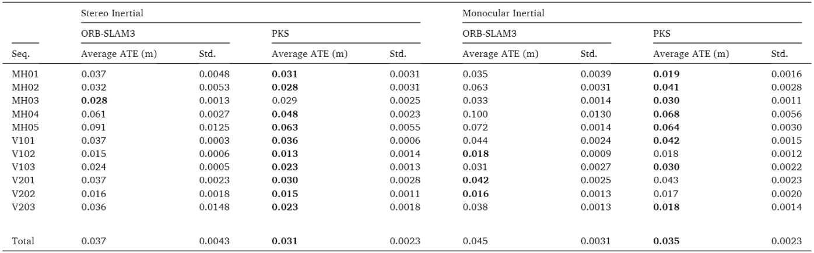

# PKS-ORB-SLAM: Photogrammetric Key-frame Selection

**Authors:** Arash Azimi

An improved Photogrammetric key-frame selection method built on ORB-SLAM3

To evaluate the performance of the PKS algorithm, two different datasets were used: the [EuRoC](https://projects.asl.ethz.ch/datasets/doku.php?id=kmavvisualinertialdatasets)
Micro Aerial Vehicles (MAV) dataset as well as an in-house dataset acquired with a developed stereo system. Both datasets 
contain stereo images and synchronized IMU measurements. The MAV dataset have also accurate
motion and structure ground-truth.

## 1. Summary
### PKS flowchart

### PKS schematic diagram

### Instrument

### Trajectory comparison

### Point-cloud comparison

### Point-cloud cross-section

### Point-cloud plane fitting

### Plane fitting statistics

### cumulative Absolute Trajectory Error (ATE) comparison

### Average ATE Results in each dataset

### Key-frame trajectories

## 2. Related Publications

Azimi, A., Ahmadabadian, A.H. and Remondino, F., 2022. **PKS: A photogrammetric key-frame selection method for visual-inertial systems built on ORB-SLAM3**. ISPRS Journal of Photogrammetry and Remote Sensing, 191, pp.18-32.

Azimi, A., Hosseininaveh, A. and Remondino, F., 2022. **A NOVEL GEOMETRIC KEY-FRAME SELECTION METHOD FOR VISUAL-INERTIAL SLAM AND ODOMETRY SYSTEMS**. The International Archives of Photogrammetry, Remote Sensing and Spatial Information Sciences, 43, pp.9-14.[PDF](https://media.proquest.com/media/hms/PFT/1/n2Y8N?_s=3Etl1aiR%2F%2F3tEARSr42grt2wCGA%3D)

## 3. License

This repository is released under [Apache License V2](http://www.apache.org/licenses/LICENSE-2.0). To develop, publication and use it, please follow the terms of this license.

## 4. Citation

If you use PKS in an academic work, please cite:

    @article{AZIMI202218,
      title={PKS: A photogrammetric key-frame selection method for visual-inertial systems built on ORB-SLAM3},
      author={Arash Azimi and Ali {Hosseininaveh Ahmadabadian} and Fabio Remondino},
      journal={ISPRS Journal of Photogrammetry and Remote Sensing},
      volume = {191},
      pages = {18-32},
      issn = {0924-2716},
      year={2022}
      doi={https://doi.org/10.1016/j.isprsjprs.2022.07.003}
     }

    @article{
      title={a Novel Geometric Key-Frame Selection Method for Visual-Inertial Slam and Odometry Systems},
      author={Arash Azimi and Ali {Hosseininaveh Ahmadabadian} and Fabio Remondino},
      journal={The International Archives of Photogrammetry, Remote Sensing and Spatial Information Sciences},
      volume = {43},
      pages = {9-14},
      issn = {1682-1750},
      year={2022}
      doi={https://doi.org/10.5194/isprs-archives-XLIII-B2-2022-9-2022}
     }

## 5. Building

To build this repository, you can follow all the steps mentioned in the original version of ORB-SLAM3 in https://github.com/UZ-SLAMLab/ORB_SLAM3

If you have a problem building this repository, you can first install the original version of [ORB-SLAM3](https://github.com/UZ-SLAMLab/ORB_SLAM3) and then replace the include and src files of this repository with the original files and rebuild it.
